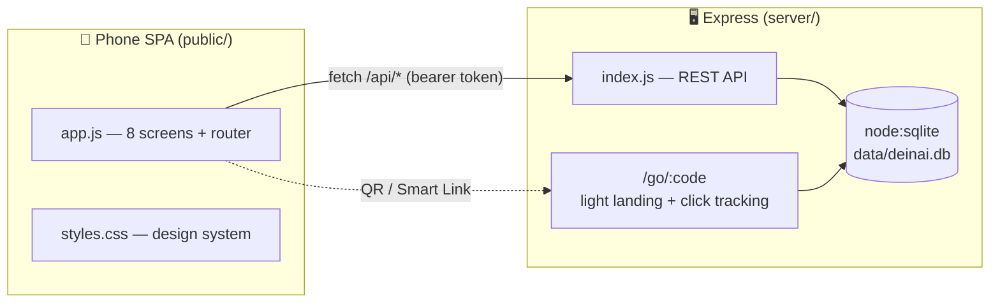
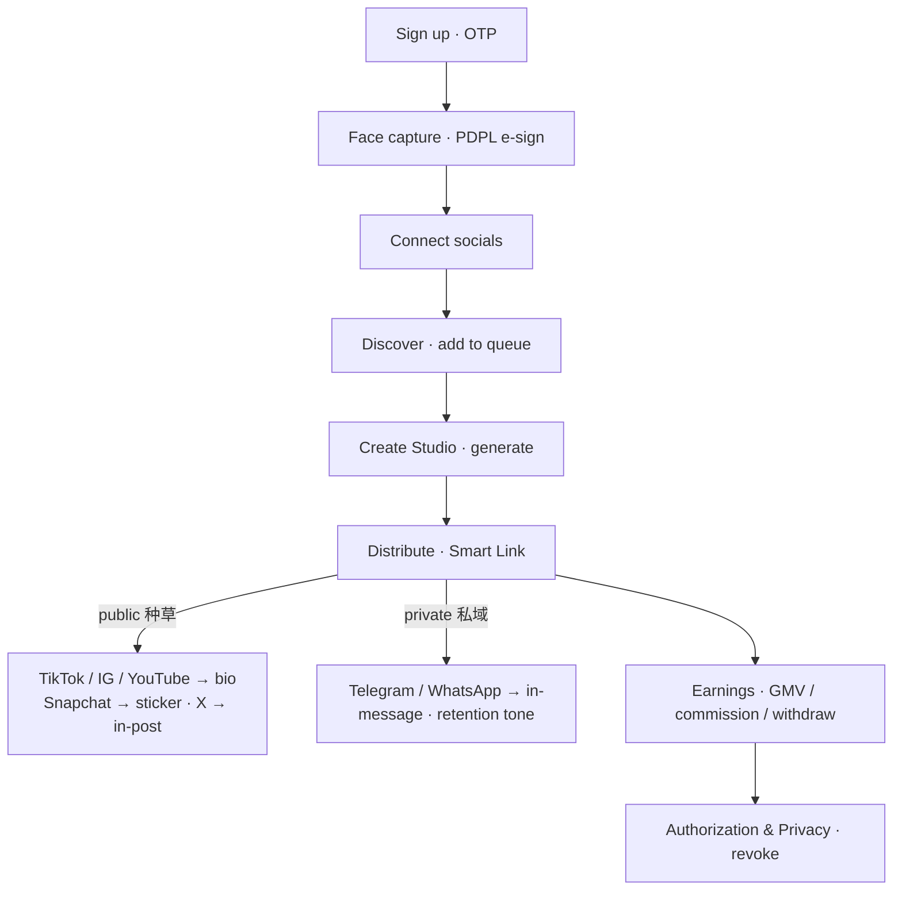

# DeiNai 2.0 · Saudi Edition — Creator AI Commerce (full‑stack)

[](https://github.com/shiyidexiaozerui-spec/deinaicreator/actions/workflows/ci.yml)
[](LICENSE)

A working, interactive full‑stack prototype built 1:1 from the original Figma/Claude design.
A creator authorizes their portrait, AI generates own‑style shoppable videos, they publish to
their socials and earn on the commission spread. English‑first, Saudi‑green theme, **SAR** currency,
with an **EN / العربية** (RTL) toggle on Discover.

The **frontend talks to the backend** for every meaningful action — auth, onboarding, products,
queue, video generation, publishing, earnings and privacy all persist in a real SQLite database.

## Run

```bash
npm install      # one dependency: express
npm start        # → http://localhost:4600
```

- App:   http://localhost:4600
- Design board (the original 1:1 restoration): http://localhost:4600/board.html

> Requires **Node 22+** (uses the built‑in `node:sqlite`; developed on Node 24). No native build step.

## Deploy

It's a standard Node web server (honours `PORT`, one‑command `npm start`), so it runs on any Node host. Config files are included:

| Host | How |
|------|-----|
| **Render** (easiest, free) | New → **Blueprint** → pick this repo. [`render.yaml`](render.yaml) does the rest. |
| **Railway** | New Project → Deploy from GitHub. Uses [`Procfile`](Procfile) / auto‑detects `npm start`. |
| **Fly.io / Cloud Run / any Docker host** | [`Dockerfile`](Dockerfile) → `fly launch` / `docker build`. |

**Going to production?** See [`docs/PRODUCTION-CHECKLIST.xlsx`](docs/PRODUCTION-CHECKLIST.xlsx) — a procurement tracker (46 items: video AI, social APIs, SMS/OTP, e‑commerce/affiliate, KYC, cloud/data‑residency, compliance) with MVP cut, lead‑times, and status/owner columns. Built for the Saudi/Gulf market.

**Storage note:** the SQLite file lives at `data/deinai.db` and is created + seeded on first boot. On ephemeral hosts (free tiers) it resets on each deploy/restart — fine for a demo. For durable data, mount a volume and point `DB_DIR` at it (see the commented block in `render.yaml`).

## Stack

| Layer    | Tech |
|----------|------|
| Frontend | Vanilla JS SPA (no build step), exact styling from the design, Google Fonts (Plus Jakarta Sans + Noto Sans Arabic) |
| Backend  | Node.js + Express REST API |
| Storage  | SQLite via built‑in `node:sqlite` → `data/deinai.db` (auto‑created & seeded) |
| Auth     | Phone + OTP → bearer token (dev mode returns the code so the prototype auto‑fills it) |

## Architecture



The **Smart Link** is the core of distribution: one tracked redirect (`go.deinai.ai/<code>` → `/go/:code`) that carries creator · video · source · promo · UTM, so conversions are trackable on every platform — even the ones whose captions can't hold a clickable link.



## Screens (flow order)

1. **Sign up / Log in** — phone + OTP (`/api/auth/*`)
2. **Face capture & authorization** — multi‑angle capture + PDPL e‑sign (`/api/portrait/authorize`)
3. **Connect social media** — read‑only OAuth, follower insights (`/api/socials/*`)
4. **Discover** — product feed, search, add‑to‑queue, **EN/العربية** toggle (`/api/products`, `/api/queue`)
5. **Create Studio** — style/template, localization (hijab overlay, Gulf accent), script regenerate, generate (`/api/videos`)
6. **Distribute** — **Smart Link** (tracked redirect + light landing) + two‑tier platform select (Public种草 / Private私域) with per‑platform, capability‑aware captions & link placement, QR, bio config, publish/schedule (`/api/smartlink`, `/api/bio`, `/api/publish`)
7. **Earnings** — withdrawable / GMV / commission, live detail list, withdraw (`/api/earnings`)
8. **Authorization & Privacy** — auth status, one‑tap revoke, data‑deletion request (`/api/authorization*`)

## API reference (all under `/api`, bearer‑auth except auth routes)

```
POST   /auth/request-code        {phone}            → {devCode}
POST   /auth/verify              {phone, code}      → {token, user, onboarding}
GET    /me

POST   /portrait/authorize
POST   /portrait/revoke

GET    /socials
POST   /socials/:platform/connect
POST   /socials/:platform/disconnect

GET    /products?q=
GET    /queue
POST   /queue                    {productId}        → {queueCount}
DELETE /queue/:id

POST   /videos                   {productId, style, language, hijab, ...}  → {id, status}
GET    /videos/:id                                  → status: generating→ready
POST   /videos/regenerate-script                    → {script}

POST   /smartlink               {videoId}            → {code, branded, url, creatorId, promo, utm}
GET    /smartlink/by-video/:videoId
GET    /qr?d=<url>                                    → SVG QR (public)
GET    /bio                                           → {configured, url}
POST   /bio/configure            {code}               → {configured:true, url}
GET    /go/:code?s=<source>      (public)             → light landing page + records click

POST   /publish                  {videoId, platforms:[ids], captions:{}, smartCode, schedule}
                                                      → {smartLink, promoCode, platforms, status}

GET    /earnings
POST   /earnings/withdraw

GET    /authorization
POST   /authorization/data-deletion
```

## Project layout

```
server/
  index.js   Express app + all routes + video-generation simulation
  db.js      SQLite schema + product seed
public/
  index.html app shell (device frame)
  app.js     SPA: 8 screens, router, API client
  styles.css design system
  board.html original 1:1 design-canvas restoration (pan/zoom + walker)
  logo.png
data/
  deinai.db  created on first run
```

## Notes

- OTP is auto‑filled in dev mode (`devCode` is returned by the API) so the flow is one‑tap.
- Video generation is simulated server‑side (status flips `generating → ready` after ~3s).
- Product images are placeholders, matching the source design.
- Reset everything by deleting `data/deinai.db`.
